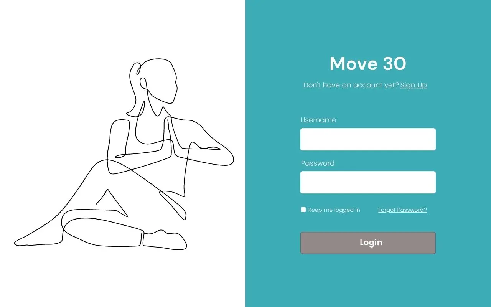

# Move 30
Move 30 is an journaling app made to encourage folks to get movement/ physical activity in for at least 30 minutes a day.

**Link to project:** Coming soon

## How It's Made:

**Tech used:** HTML, CSS, JavaScript, EJS, Node, Express

Users can create posts documenting their movement of the day and see others posts as well.

## Demo user logins:
**User 1:** 
username: demo1@demo.com
password: demo1demo1

**User 2:** 
username: demo2@demo.com
password: demo2demo2

## Optimizations: ##

## Lessons Learned:
